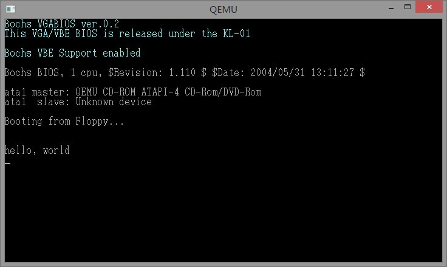

title:30天自制操作系统-第一天
date:23:34 2013/3/2
tag:os

第一天的目的显然是hello world。

书中使用了非常小的虚拟机qemu

下载01，打开其中的qemu，运行批处理文件qemu-win.bat

我已经事先把helloos.img复制到qemu文件夹下。去掉了很多不必要的操作。

运行出的界面就是这个。

我们今后要做的我猜就是如何完善这个helloos.img这个镜像文件。

文中第一天就有大量的16进制汇编代码。这里就不写出来了。我觉得毫无意义，只会吓跑新手。运行出来才是作重要的。