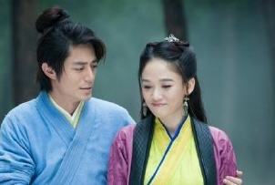
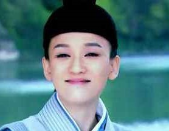
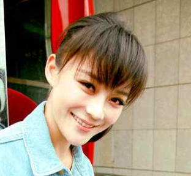
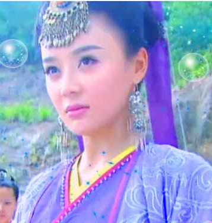
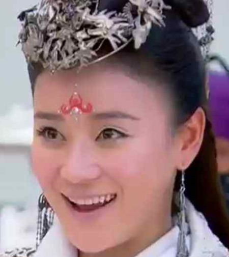
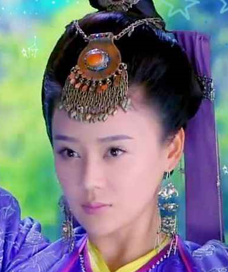
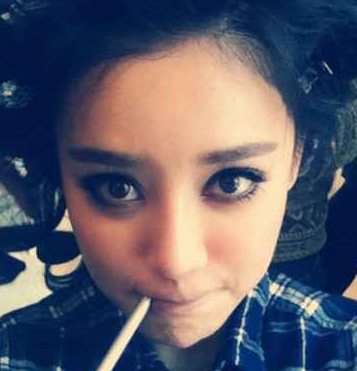

date:9:38 2013/2/24
title:我的偶像袁姗姗

最近追剧笑傲江湖，发现其中任盈盈最最好看，上网一查，原来她叫袁姗姗。我和网上和朋友交流道，袁姗姗真是美啊，朋友们都说，陈乔恩完爆袁姗姗。当时我就震惊了，陈乔恩能比袁姗姗美？

`左为袁姗姗，右为陈乔恩。`

当时我就想，一定是我审美出了问题！

于是我上网去了解陈乔恩和袁姗姗

图片对比。。

吐槽下陈乔恩，陈乔恩在我眼里就像个猴子。一脸憋屈样，怎么看都像是便秘。	

上网瞧瞧袁姗姗微博

袁姗姗前天（2-22）才生日啊，多少人在下面一个劲人身攻击，我觉得袁姗姗开着评论也是一种勇气。

还翻到这篇文章

[南都娱乐周刊采访袁姗姗](http://www.smweekly.com/news/report/201301/32303.aspx)

其中这段特感人

	南都娱乐周刊：面对“香肠嘴”、“脸像一支化了的冰淇凌，鼻子眼睛嘴巴就那么摊在一张脸上”的抨击，也能很淡定？

	袁姗姗：对啊，“冰淇淋化了”我不知道，但香肠嘴我知道啊，所以我说自己自带香肠，哈哈！我自己已经完全不Care这些东西了，一开始会不开心，但现在好像没什么感觉了。

袁姗姗完全就是那种大大咧咧，内心强大的女孩。

我实在不知道每天以黑别人香肠为乐的人什么心态。

整天跟着营销号瞎起哄？

我觉得袁姗姗最性感的地方就是她的嘴唇。

人家演这任盈盈，有人非说她袁小三。你怎么不说东方不败才是令狐冲和岳林姗之间的小三啊。

我追这剧的一个原因就是我刚好在这个寒假看了原著。任盈盈和小师妹无疑是两个女主，而袁姗姗的演技我觉得完全符合原著。甚至超出预期。

大家不妨搜一下微博上的`#袁姗姗#`关键词。谩骂连天。

她承受的舆论压力太沉重，重的让人心疼。

真的很佩服她，处之泰然，不以物喜，不以己悲。

有人把她跟杨幂对比，说她就是下一个杨幂

哦，不要以为这是好话，他们觉得她比杨幂还丑。当时我就不开心了，杨幂和袁姗姗是我最喜欢的两个女明星，你这一黑黑俩不合适吧

这让我想起那个转发量很高的段子：`与人相处前必须问对方的29个问题`

问题第一个就是杨幂好看不好看。

他们转发并大呼：`#杨幂好不好看绝壁是判断两个人要不要在一起的唯一标准#`

当时我就惊呆了，不敢说自己偶像是杨幂。感觉整个氛围就是喜欢杨幂就要被鄙视。

后来我们问了现实中的一个朋友，他们很少上网，但他们都觉得杨幂很美。

我实在没想到居然可以凭别人偶像来判断一个人的。

不过这也难怪，还有人看不起用小米手机的呢。

不过你不用担心以后买车也会因为`品味`而被其他人鄙视，因为这么想的人多半根本就买不起车。

扯远了，总之袁姗姗真的很美，她谦虚，美好，又纯真。

她调皮可爱，又温柔的像个大姐姐，完全演出了金庸笔下最美女主`任盈盈`。

你问到底是什么让我如此喜爱袁姗姗，我一定会说，是她的微笑。

她完美的古装形象，谈笑间风情万种，绝世倾城。

当你发现自己的审美与舆论相反，不要感到丢脸，也许你这才是现实的大多数

文末，又想起那句老话：经得起多少诋毁，就担得起多少赞美

加油，我的偶像袁姗姗

