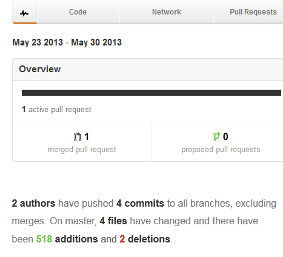
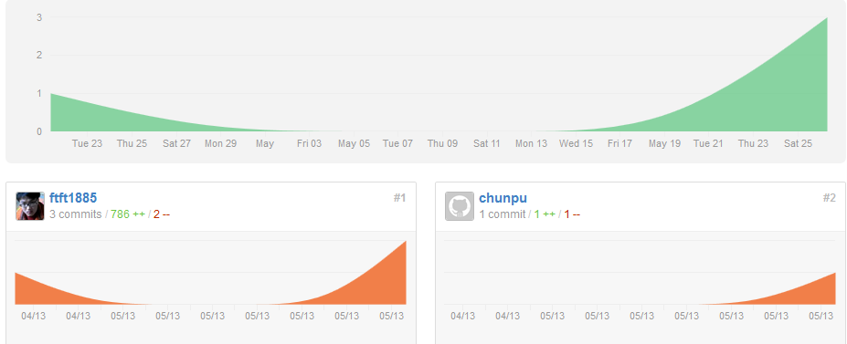

title:玩转github
date:19:16 2013/5/30

github提供了自己的git训练<http://training.github.com/>

用git不玩玩[github](https://github.com/)那就蠢死了，github是托管服务。你也许会说我自己也会搭个git服务器额，那确实，但是github提供展示的功能，以及多人合作，进度可视化等很多自己搭服务器所没有的功能。github还提供付费服务<https://github.com/plans>，可以看到github完全没有public repo数量的限制。这相当于是无限容量额。。

如果你非想要private账号，那就拿着自己的学校邮箱去注册吧<https://github.com/edu>,他会把你的账号升级为Micro账号，也就是拥有5个private repo，可以偷偷放不想被人看到的东西啦。

github提供了windows osx linux的客户端，但其实并不推荐，特别是windows，装了github的电脑会变慢，而且github客户端不能给其他用。windows下尤其推荐这个[mysisgit](http://msysgit.github.io/),下载地址<https://msysgit.googlecode.com/files/Git-1.8.1.2-preview20130201.exe>，就15M，比起linux下的git-core貌似还小点，注意安装的时候只需要选git bash就行了（用啥子gui额），总之在windows下使用git一点都不输linux。

https
------
github一个特点就是支持https提交（remote是https协议），就是通过github账号和密码来提交，这使得根本不需要在电脑上保存ssh-key就可以提交代码，所以你可以随便在其他电脑上clone自己的repo，而不用担心repo被其他人修改并push到github上去。

Pages
=========
github一个非常帅气的功能，pages即展示页面，可以理解为静态的http服务器，不过也支持一些模板渲染，这不重要。

github的pages分两种

User Page
---------
即用户自己的page，只需在github中新建一个叫`<yourname>.github.io`的repo即可。访问也是通过`<yourname.github.io>`来访问啦。注意访问返回的结果是master分支上的文件。

本来page的路径是`<yourname.github.com>`，但由于cookie攻击，导致github将page的静态服务和本身区分出来。

Project Page
----------
project page指的是一个repo的专属page，访问路径是`<yourname>.github.io/<reponame>`

与user的pages相比project page只有一个不同，就是project page虽然用的是同一个repo，但用的是gh-pages这个分支（github-pages的简称啦）。

project page的教程<https://help.github.com/articles/creating-project-pages-manually>

github多人合作
======
多人合作一直是github的特色，它的合作方式在我看来有3种

Organization（在账号设置/organizations中）
----------
这是一种团队合作，所有账号都是平等的。但是不推荐这种东西。（因为我还没看懂怎么用）

fork后pull request
---------
最常用的方式，也就是普通人参与大项目的方式，fork并修改后，点击Pull Request，就能看到一个repo向另一个repo申请merge的请求了。

而在repo主人那个账号上，也能看到Pull Requests加了个1，issue也加了1,repo的主人merge后request和issue都减1。这种合作方式我称之为弱合作，因为主人只是看到申请merge，主人只有确认merge你的commit才会被采纳。 而下面要讲的强合作collaboration是直接修改owner/repo这个repo的，合作者都不需要fork，同一个repo，也说不上merge，就是单纯的commit。

Collaboration（合作者）
--------
这个是repo的功能，在repo设置中的Collaboration中。我把这种合作方式称为强合作，因为合作者也可以直接修改其中的内容。因此这也是一种危险的动作，等于直接把自己房间的钥匙交给了别人，github中需要输入密码才可以添加合作者。

在repo的主人把你加为Collaboration后，你的repo中的会自动出现那个repo，这并不是一个fork，而是直接是source。

加入合作者用大白话说就是用合作者的密码也可以向remote提交了。如果你发现自己的提交依然算在作者头上，那是因为你没有修改自己commit的user.email。（注意： github并不以user.name来确认提交的作者，而是单单用user.email，所以必须把user.email改为自己在github上注册的邮箱才行--`git config user.email <myemail>`）

这样的提交才会算到自己头上，才会Graph中的contribution中出现自己的贡献。

那小段曲线就是一个基本的可视化，上面显示了2个作者，4次commits，1个merge。 所有的collaboration都是commit，pull request则属于merge。

在Graphs中的Contribution中，贡献更是一目了然

如果你有幸成为Collaboration，那repo主人一定太信任你了。

可以说github最大的贡献除了可以分享代码，应该就是进度和贡献可视化了。这是公司自己搭git服务器所不能比拟的。

待续。。。

