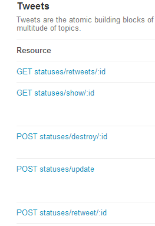

title:RestAPI入门笔记
tag:rest
date:2013/1/17

# What is REST?
>- it is short for `Representational State Transfer`
- clients touch resourse by url.

# Why Use Rest Api
> ## Http method
+ GET (query)	
+ POST (add & update)
+ PUT (add & update)
+ DELETE (delete)

>## Stateless
>> we can even use curl to update sth instand of browser

>## One server,Any client
>> easy to write a client(web phone desktop),we just use the web api,all we need is	 a painter.

>## Easy to write an API document
*just need to write:*
>> 
1. method
2. parameter
3. response json(xml)

# Restful Api Example

#####`GET` example from aliyun oss:
	:::javascript
	GET /?prefix=fun/&delimiter=/ HTTP/1.1
	Host: oss-example.oss.aliyuncs.com
	Date: Fri, 24 Feb 2012 08:43:27 GMT
	Authorization: OSS qn6qrrqxo2oawuk53otfjbyc:DNrnx7xHk3sgysx7I8U9I9IY1vY=

#####`PUT` example from oss *(upload sth)*
	:::javascript
	{ headers: 
   		{ 'Content-Type': 'application/json',
	      'Content-Length': 3072,
	      'Content-md5': '0d35803ba5e0af468002e0e7c1dff541',
	      Authorization: 'OSS ddPofY9mfxnGNEsb:J/kDu5f/8IJb35lsjZpxztW9SG8=',
	      Date: 'Thu, 17 Jan 2013 14:18:27 GMT',
	      Host: 'oss.aliyuncs.com:80' },
	  hostname: 'oss.aliyuncs.com',
	  port: 80,
	  path: '/****/fuckyou.db',
	  method: 'PUT' }

+ Api Doc Example from twitter *(same as weibo..)*
>we can see they only use get and post

	
# How to Design a Restful Api
>*it is just my task todo!*

# Sth more
1. always use access_token to diff users.
2. use a sid *(mostly parameter to md5)* to authorize that it is done by developper
3. facebook use another api `graph api`.
+ every url means one object
+ example : https://graph.facebook.com/OBJECT_ID/CONNECTION_TYPE
+ if you are new to graph api,you can start with [Graph API Getting Started Guide](https://developers.facebook.com/docs/getting-started/graphapi/) from facebook.