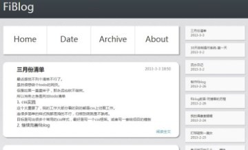
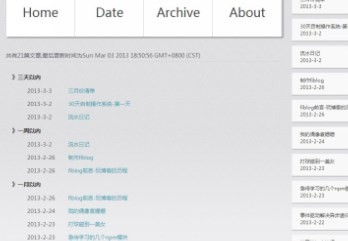

date:19:53 2013/3/3
title:fiblog0.1.17发布
tag:fiblog

###本次版本终于可以见人了。

当然它依然极其不完善。

（顺便重做了个模板。嗯，模仿lofter的风格）

这次的重大突破是实现了模板中无限嵌套子模板

fiblog本身和模板完全分离。

造成的结果是

> fiblog本身代码减少。

> 代码全部转移到模板文件上了。

不过这绝对是正确的选择。

###fiblog仅仅做三件事：

1. 将md文件转换成html

2. 将每个blog读取并且在hash表中存入blog的属性

3. 当一个最基本的mime服务器。

也就是fiblog仅仅提供blog的接口信息（`博客标签`，`排序`，`路径`等）

模板靠这些接口写出所有页面。

###重点：在模板的渲染属性中加入请求的pathname。

这样可以在模板中处理不同的url了，所有带有extname的url请求交给mime。

无后缀或者'.md'后缀的交给模板处理。

嵌套子模板的方式使得整个模板文件变的非常简洁明了

