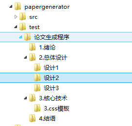
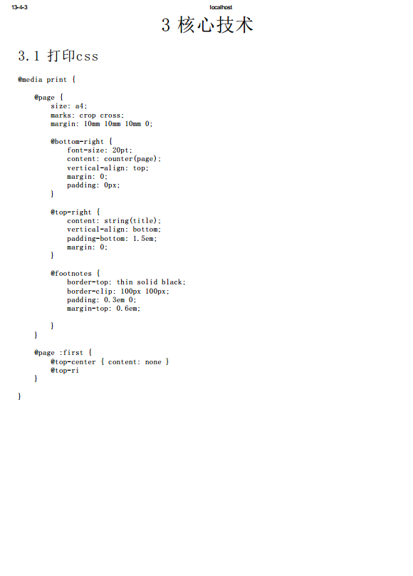
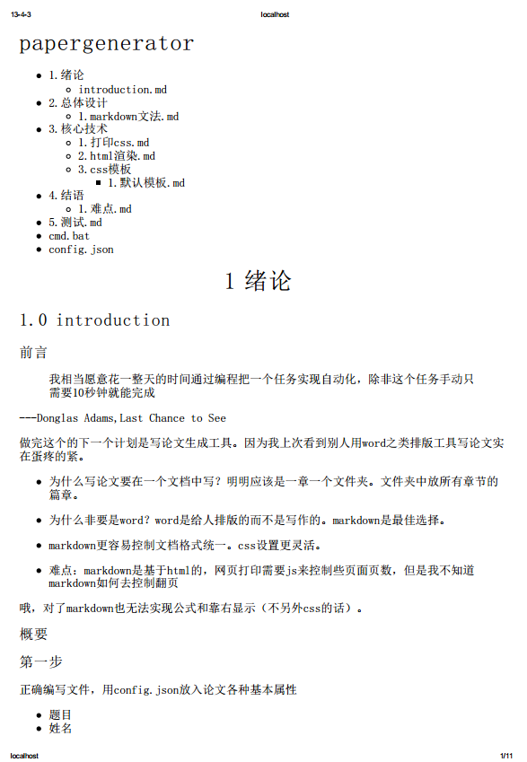

title:论文构建 格式生成程序papergenerator
date:14:01 2013/4/3

卷首语：
------------------

 > 我相当愿意花一整天的时间通过编程把一个任务实现自动化，除非这个任务手动只需要10秒钟就能完成 					

前言
----------------

我想大概没有比我更无聊的人了。

据说4月15日毕设中期检查，我寻思要开始写论文了。

我不会使用word，你可以称我是电脑白痴。

我甚至不会使用excel，上次帮妈妈做执勤统计软件，我还是先把excel成csv格式的。

写这货的原因之一是我觉得论文用word写简直是自虐，用格式刷一个一个统一格式？

拿着草稿纸自己画着小标题小论文提纲？

上万字的论文，即便是滚轮飞快也总是找不到自己上次写到哪了。

不要怀疑如果突然要求你改一个格式，你不得不再从上往下滚一遍，格式刷用的手抖

原因之二是前几日我知道了Ant，Grunt这些构建工具。

我意识到编码规范化是如此重要。

如果需要制作一个巨大的工程，这些构建工具是必要的。

他们基础功能的原理并不复杂。

那Ant来讲，使用Ant构建程序主要是写它的xml配置文件，里面可以选择Lint语法检查，文件合并顺序，加工等。

我还没有足够大的工程需要用到这种自动化构建程序，但也对这种想法非常崇拜。有些构建程序甚至包含了自动化测试。

文件路径一般分为`src`,`lib`,`test`,`build`等，一目了然。

我认为写一篇上万字的论文也应该是这样的（测试演示）

如图

每个文件夹代表一个章节

文件夹中的.txt或者.md则是正文。md是啥？请百度markdown。

文件夹表示嵌套关系，文本文件的文件名前序号表示构建顺序。

长篇大论的一个word变成文件夹和文本文件的组合。

论文框架一下就清楚明了起来。

当然，文件夹中也能继续包含文件夹，大章节包含小章节，无限嵌套，小标题自动生成。

这个嵌套是我花时间最长的。这种未知深度构建hash表的问题我一直都很头大，如果您也曾碰到这个问题，那你一定瞬间听懂我在讲什么的。

贴上代码

	function arr2json(arr,json) {	    
	    if (arr.length === 1) {	
	        json[arr[0]] = 1;	
	    } else {	
	        var tmp = arr.shift();	
	        if (typeof json[tmp] === 'object') {	
	            arr2json(arr,json[tmp]);	
	        } else {	
	            var last = "", str;
	            for (var i = 0; i < arr.length; i++) {	
	                last += '}';	
	            }
	            str = '{"' + arr.join('":{"') + '":' +  '"1"' + last;
	            json[tmp] = JSON.parse(str);	
	        }
	    }	    
	}

总之是做出来啦啦啦

看一下成果，（请务必无视图片中内容，完全是为了测试胡乱打字凑数的）

可以看出

+ 论文自己带上了格式，并且生成了目录

+ css也是可以强制换页和显示页眉页脚的

+ 显示代码尤为简单和工整（代码高亮从此不愁！）

一想到以前写实验报告是不停的按回车来换页，我就暗骂自己“笨笨笨，真是笨死了”

感觉丑爆了？我还没有写任何css呢，这是刚做完的雏形，这几天css功力小幅提升，再写几百行就能比word写的论文好看十倍！

不过这东西完全我自己玩着爽（像构建程序那样构建论文），并不寄希望别人用（我担心他们没听过markdown）。喜欢用word的童鞋估计也很难理解构建程序的精妙之处

听说图灵印书也开始用markdown了。

啥。你说字数统计？等我改进下我的codecounter，把每个文件的行数和字数以及整个的行数字数都瞬间显示

当papergenerator有三套以上主题皮肤时就可以提交了，俗归俗，我觉得随意切换主题皮肤才是自动化构建工具相比word完胜的地方。

